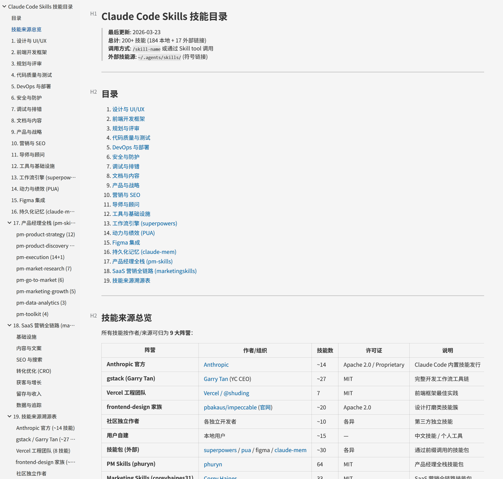
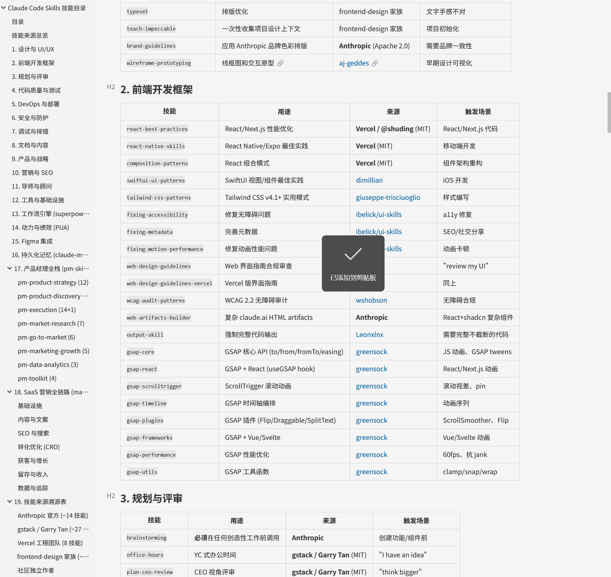
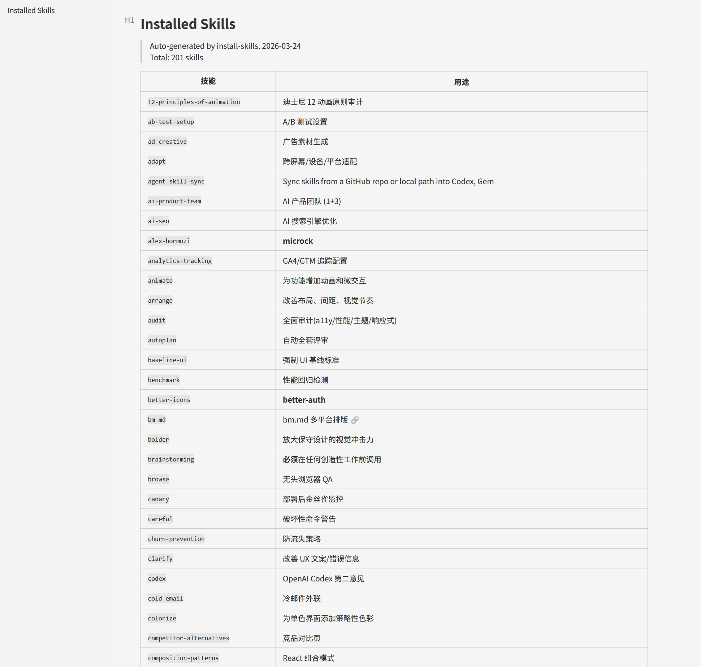

# install-skills

[English](#english) | [中文](#中文)

---

<a id="english"></a>

## English

> Install once, keep six AI agent hosts in sync.

### What It Solves

Claude, Codex, Gemini, Kiro, Cursor, and `.agents` all keep skills in different directories. Manual copying creates missed installs, drift between hosts, and maintenance overhead.

`install-skills` turns that into one workflow with one source of truth.

### Capabilities

| Feature | Description |
|---------|-------------|
| **6 entry points** | GitHub repo install / sync from Claude / local directory or ZIP / standalone catalog refresh / provenance investigation / version check |
| **Provenance investigation** | Three-tier search (GitHub / Marketplace / find-skills) to trace unknown skills and classify as community or user-created |
| **Version tracking** | `.origin.json` per skill records source, commit hash, content hash; Entry F checks for updates without re-cloning |
| **Marketplace-aware** | Detects Claude marketplace installs first, then falls back to repo clone flow when needed |
| **6-host support** | Claude, Codex, Gemini, Kiro, Cursor, and `.agents` |
| **Single Source of Truth** | Default model keeps physical files in Claude and syncs other hosts from there |
| **Conflict detection** | Scans all hosts before install and supports overwrite / skip / coexist |
| **Prefix naming** | Applies prefixes like `pm-` or `mkt-` consistently across hosts |
| **Catalog maintenance** | Updates `SKILLS-CATALOG.md` with category tables, source provenance, and quick guide content |
| **Per-host manifest** | Generates `INSTALLED.md` independently for each host |
| **Repo layout detection** | Handles `skills/<name>/`, `<category>/skills/<name>/`, and flat skill layouts |
| **Cross-platform** | Uses native symlinks where safe and Python `os.symlink` on Windows |

### Supported Agent Hosts

| Host | Path |
|------|------|
| Claude | `~/.claude/skills/` |
| Codex | `~/.codex/skills/` |
| Gemini | `~/.gemini/antigravity/skills/` |
| Kiro | `~/.kiro/skills/` |
| Cursor | `~/.cursor/skills/` |
| .agents | `~/.agents/skills/` |

### Six Entry Points

```text
Entry A: GitHub repo install
  User provides a GitHub URL and asks to install it.
  Flow: marketplace check -> clone or official install -> conflict check -> naming -> install -> generate .origin.json -> catalog update -> report

Entry B: Sync from Claude to other hosts
  After `npx skills add` or `find-skills` installs into Claude only.
  Flow: detect new skill -> sync to other 5 hosts -> update catalog -> regenerate INSTALLED.md -> prompt provenance check

Entry C: Local directory or ZIP install
  User already downloaded a skill pack manually.
  Flow: locate `SKILL.md` -> reuse Entry A install logic -> report

Entry D: Catalog refresh only
  No new install. Rebuild `SKILLS-CATALOG.md` and `INSTALLED.md` from the current host state.
  Flow: scan -> regenerate -> prompt version check -> prompt provenance check if unknown skills found

Entry E: Provenance investigation
  Investigate unknown/unattributed skills via three-tier search.
  Flow: scan unattributed -> GitHub search -> marketplace search -> find-skills -> classify as community or user-created -> generate .origin.json -> update catalog

Entry F: Version check
  Check if installed skills have newer versions available.
  Flow: scan .origin.json -> query remote sources -> compare content hashes -> report -> user decides to update or skip
```

### Architecture

#### Default sync model

```text
~/.claude/skills/              -> physical files, primary source
    skill-a/
    skill-b/
    SKILLS-CATALOG.md

~/.codex/skills/               -> synced from Claude
    skill-a -> ~/.claude/skills/skill-a
    skill-b -> ~/.claude/skills/skill-b
    INSTALLED.md

~/.gemini/antigravity/skills/  -> same pattern
~/.kiro/skills/                -> same pattern
~/.cursor/skills/              -> same pattern
~/.agents/skills/              -> same pattern
```

#### Marketplace exception

If a GitHub repo exposes an official Claude marketplace install command, this skill prefers that path for Claude. In that case:

- Claude uses the official marketplace-managed install.
- The other 5 hosts receive standalone copies instead of symlinks.
- This avoids coupling non-Claude hosts to marketplace-specific behavior.

### Catalog Model

- `SKILLS-CATALOG.md`: the global knowledge map, with categories, provenance, and quick-selection guidance.
- `INSTALLED.md`: per-host install state, generated independently for each host.

### Screenshots

**SKILLS-CATALOG overview**:



**SKILLS-CATALOG detail**:



**INSTALLED.md**:



### Trigger Phrases

| Type | Triggers |
|------|----------|
| Chinese install | `装这个` / `把这个装上` / `把这个仓库的 skill 都装上` / `我下载了一个 skill 包` |
| English install | `install this` / `add this skill` / `add these skills` |
| Claude-only sync | Run after `npx skills add` or `find-skills` installs into Claude only |
| Refresh only | `更新目录` / `刷新 catalog` / `生成 installed` / `refresh catalog` / `update catalog` |
| Provenance | `溯源` / `排查来源` / `查来路` / `trace origin` / `find source` / `这些 skill 哪来的` |
| Version check | `检查更新` / `check updates` / `哪些 skill 过时了` / `skill 有新版吗` / `update check` |

### File Structure

```text
install-skills/
├── SKILL.md
├── README.md
├── assets/
│   ├── installed-md.png
│   ├── skills-catalog-detail.png
│   └── skills-catalog-overview.png
├── references/
│   ├── catalog-skeleton.md
│   └── origin-schema.md
└── scripts/
    └── gen_installed.py
```

### Practical Notes

| Do this | Avoid this | Why |
|---------|------------|-----|
| `git clone --depth 1` | Full clone | Skill repos may have heavy history |
| Check conflicts across **all** hosts | Only check Claude | Same-name skills may already exist elsewhere |
| Use Python `os.symlink` on Windows | Git Bash `ln -s` | Git Bash may create copies instead of true symlinks |
| Pull human descriptions from `SKILLS-CATALOG.md` | Truncate frontmatter blindly | Frontmatter is optimized for trigger discovery, not human reading |
| Generate `INSTALLED.md` per host | Share one manifest | Actual install state can differ by host |
| Generate `.origin.json` on install | Skip version tracking | Without it, skills become version orphans that can never be updated |
| Use `git ls-remote` for version checks | Clone to compare | ls-remote queries refs only, orders of magnitude faster |

### Requirements

- Python 3.x
- Git for GitHub-based installs
- At least one target host directory present on disk

### License

MIT

---

<a id="中文"></a>

## 中文

> 装一次，让六个 AI agent host 保持同步。

### 它解决什么问题

Claude、Codex、Gemini、Kiro、Cursor 和 `.agents` 都有各自的 skill 目录。手动复制到 6 个地方，常见结果就是漏装、版本漂移、后续维护失控。

`install-skills` 把这件事收敛成一套可重复执行的流程。

### 核心能力

| 能力 | 说明 |
|------|------|
| **6 个入口** | GitHub 仓库安装 / 从 Claude 同步 / 本地目录或 ZIP 安装 / 仅刷新目录文档 / 溯源排查 / 版本检查 |
| **溯源排查** | 三级搜索（GitHub / Marketplace / find-skills）追踪来路不明的 skill，归类为社区来源或用户自建 |
| **版本追踪** | 每个 skill 生成 `.origin.json` 记录来源、commit hash、content hash；入口 F 无需重新克隆即可检查更新 |
| **识别 marketplace** | 先检测仓库是否支持 Claude marketplace 官方安装，再决定走官方还是 clone 流程 |
| **支持 6 个 host** | Claude、Codex、Gemini、Kiro、Cursor、`.agents` |
| **Single Source of Truth** | 默认以 Claude 目录为唯一实体源，其它 host 从这里同步 |
| **冲突检查** | 安装前扫描所有 host，支持覆盖 / 跳过 / 共存 |
| **统一前缀命名** | 如 `pm-`、`mkt-` 这类前缀会一致应用到所有 host |
| **维护 SKILLS-CATALOG** | 自动更新分类表、来源溯源和快速选择指南 |
| **生成 INSTALLED.md** | 每个 host 独立生成自己的安装清单 |
| **自动识别仓库结构** | 兼容 `skills/<name>/`、`<category>/skills/<name>/` 和扁平布局 |
| **跨平台** | macOS/Linux 用符号链接，Windows 用 Python `os.symlink` |

### 支持的 Agent Host

| Host | 路径 |
|------|------|
| Claude | `~/.claude/skills/` |
| Codex | `~/.codex/skills/` |
| Gemini | `~/.gemini/antigravity/skills/` |
| Kiro | `~/.kiro/skills/` |
| Cursor | `~/.cursor/skills/` |
| .agents | `~/.agents/skills/` |

### 六个入口

```text
入口 A：从 GitHub 仓库安装
  用户给出 GitHub URL 并要求安装。
  流程：检测 marketplace -> 官方安装或 clone -> 冲突检查 -> 命名 -> 安装 -> 生成 .origin.json -> 更新目录 -> 汇报

入口 B：从 Claude 同步到其它 host
  适用于 `npx skills add` 或 `find-skills` 只装进 Claude 之后。
  流程：识别新 skill -> 同步到其它 5 个 host -> 更新目录 -> 重建 INSTALLED.md -> 提示溯源排查

入口 C：从本地目录或 ZIP 安装
  适用于用户已经手动下载 skill 包。
  流程：定位 `SKILL.md` -> 复用入口 A 的安装流程 -> 汇报

入口 D：只刷新目录文档
  不安装新 skill，只根据当前状态重建 `SKILLS-CATALOG.md` 和 `INSTALLED.md`。
  流程：扫描 -> 重建 -> 提示版本检查 -> 如有来源未明的 skill 则提示溯源排查

入口 E：溯源排查
  调查来路不明的 skill，通过三级搜索追踪来源。
  流程：扫描未归属 skill -> GitHub 搜索 -> Marketplace 搜索 -> find-skills 搜索 -> 归类为社区来源或用户自建 -> 生成 .origin.json -> 更新 CATALOG

入口 F：版本检查
  检测已安装 skill 是否有新版可用。
  流程：扫描 .origin.json -> 查询远程来源 -> 对比 content hash -> 汇报 -> 用户决定是否更新
```

### 架构说明

#### 默认同步模型

```text
~/.claude/skills/              -> 实体文件，主源
    skill-a/
    skill-b/
    SKILLS-CATALOG.md

~/.codex/skills/               -> 从 Claude 同步
    skill-a -> ~/.claude/skills/skill-a
    skill-b -> ~/.claude/skills/skill-b
    INSTALLED.md

~/.gemini/antigravity/skills/  -> 同样模式
~/.kiro/skills/                -> 同样模式
~/.cursor/skills/              -> 同样模式
~/.agents/skills/              -> 同样模式
```

#### Marketplace 例外

如果 GitHub 仓库本身提供 Claude marketplace 官方安装命令，这个 skill 会优先这样做。此时：

- Claude 走官方 marketplace 安装。
- 另外 5 个 host 使用独立副本，而不是符号链接。
- 这样可以避免把官方安装行为和本地链接策略强耦合。

### 目录模型

- `SKILLS-CATALOG.md`：全局知识地图，记录分类、来源和快速选择入口。
- `INSTALLED.md`：单个 host 的安装现状，每个 host 独立生成。

### 效果截图

**SKILLS-CATALOG 总览**：


**SKILLS-CATALOG 详情**：


**INSTALLED.md**：


### 触发方式

| 类型 | 触发词 |
|------|--------|
| 中文安装 | `装这个` / `把这个装上` / `把这个仓库的 skill 都装上` / `我下载了一个 skill 包` |
| 英文安装 | `install this` / `add this skill` / `add these skills` |
| Claude-only 同步 | 在 `npx skills add` 或 `find-skills` 只装进 Claude 后触发 |
| 仅刷新目录 | `更新目录` / `刷新 catalog` / `生成 installed` / `refresh catalog` / `update catalog` |
| 溯源排查 | `溯源` / `排查来源` / `查来路` / `trace origin` / `find source` / `这些 skill 哪来的` |
| 版本检查 | `检查更新` / `check updates` / `哪些 skill 过时了` / `skill 有新版吗` / `update check` |

### 文件结构

```text
install-skills/
├── SKILL.md
├── README.md
├── assets/
│   ├── installed-md.png
│   ├── skills-catalog-detail.png
│   └── skills-catalog-overview.png
├── references/
│   ├── catalog-skeleton.md
│   └── origin-schema.md
└── scripts/
    └── gen_installed.py
```

### 实战注意点

| 这样做 | 不要这样做 | 原因 |
|--------|------------|------|
| `git clone --depth 1` | 完整克隆 | skill 仓库常常历史很重 |
| 检查 **所有** host 的冲突 | 只检查 Claude | 其它 host 也可能已经有同名 skill |
| Windows 用 Python `os.symlink` | Git Bash `ln -s` | Git Bash 可能创建副本而不是真正链接 |
| 从 `SKILLS-CATALOG.md` 提取人类描述 | 直接截断 frontmatter | frontmatter 更适合 LLM 触发，不适合人读 |
| 每个 host 独立生成 `INSTALLED.md` | 共用一份清单 | 各 host 的实际安装状态可能不同 |
| 安装时立即生成 `.origin.json` | 装完不记录来源 | 没有 `.origin.json` 的 skill 无法检查更新，变成版本孤儿 |
| 用 `git ls-remote` 查远程版本 | 克隆后再比较 | ls-remote 只查 ref，不下载内容，快几个数量级 |

### 依赖

- Python 3.x
- Git（用于 GitHub 安装入口）
- 磁盘上至少存在一个目标 host 目录

### 许可证

MIT
